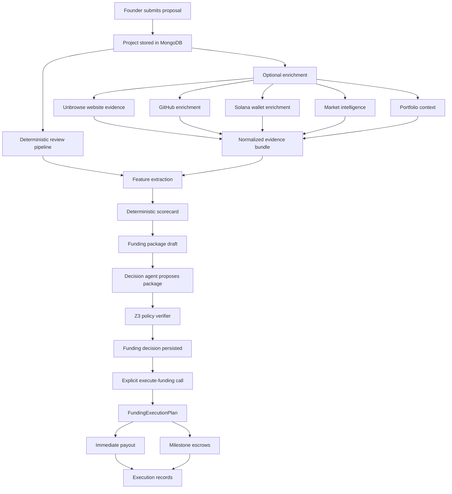

# AutoVC

AutoVC is a hybrid venture-funding system for startup proposals. It combines:

- structured founder submissions
- web diligence with Unbrowse
- on-chain diligence with Solana RPC
- deterministic normalization and scoring
- treasury-aware capital policy with Meteora Dynamic Vault context
- agentic funding proposals verified with Z3
- explicit payment execution handoff through the current Base Sepolia escrow rail

The important design choice in this repo is separation of concerns:

- diligence can use LLMs and external services to gather evidence
- scoring is deterministic
- decision making is agentic, but verifier-gated
- execution is explicit and separate from review

This keeps the system explainable while still letting the agentic parts operate where they add the most value.

## What AutoVC Does

At a high level, AutoVC takes a proposal from founder input to a verified funding package:

1. Founder submits a proposal.
2. AutoVC enriches the proposal with external evidence.
3. Evidence is normalized into structured facts with provenance.
4. Deterministic features are extracted.
5. Deterministic scoring produces a scorecard and funding package draft.
6. A decision agent proposes a final decision package.
7. Z3 verifies the package against treasury and policy constraints.
8. Treasury policy determines whether the capital structure is safe.
9. Funding execution is triggered explicitly, not automatically.
10. Immediate payouts and milestone escrows are recorded as execution records.

## Core Systems

### Unbrowse

Unbrowse is the web diligence layer. AutoVC uses it to corroborate claims from public startup web properties.

What it is used for in this repo:

- resolving structured intent against founder websites
- searching for existing Unbrowse skills for a domain
- collecting web evidence from targeted pages
- returning structured evidence instead of free-form summaries

Where it lives:

- [backend/agents/data_collector.py](/C:/Users/deepa/Desktop/Hackathon/agentic-funding/backend/agents/data_collector.py)
- [packages/diligence/src/unbrowseClient.ts](/C:/Users/deepa/Desktop/Hackathon/agentic-funding/packages/diligence/src/unbrowseClient.ts)

How it is used:

- homepage and targeted site pages are selected
- domain search is used to find existing Unbrowse skill candidates
- intent resolution is used to extract evidence for product, market, traction, and team claims
- responses are normalized into explicit facts with source references

Stored outputs include:

- facts
- sources
- timestamps
- support status
- contradiction flags
- raw payload hashes

### Solana

Solana is the on-chain diligence layer.

Important distinction:

- Solana is currently used for diligence and evidence generation
- Solana is not yet the live payout rail in this repo
- the current MVP payout rail is Base Sepolia

What AutoVC pulls from Solana:

- wallet balance
- token accounts
- recent signatures
- derived wallet activity signals
- indexed-style deterministic history features from RPC transaction history

Where it lives:

- [backend/agents/solana_enrichment.py](/C:/Users/deepa/Desktop/Hackathon/agentic-funding/backend/agents/solana_enrichment.py)
- [packages/diligence/src/solanaEnrichment.ts](/C:/Users/deepa/Desktop/Hackathon/agentic-funding/packages/diligence/src/solanaEnrichment.ts)

Why Solana matters in AutoVC:

- it lets the system verify real founder wallet activity
- it gives deterministic on-chain evidence without asking an LLM to infer wallet behavior
- it strengthens confidence and reduces blind trust in founder-submitted claims

Address fields in the proposal schema:

- `recipient_wallet`
  - legacy compatibility field
  - still used as an enrichment fallback
- `recipient_solana_address`
  - explicit Solana payout / identity field
- `recipient_evm_address`
  - explicit EVM payout field
- `preferred_payout_chain`
  - execution hint for future multi-chain payout routing

### Meteora

Meteora is the treasury strategy layer for idle capital.

AutoVC does not treat all treasury capital as immediately deployable. Capital is partitioned into buckets first, then only eligible idle capital is considered for yield strategy allocation.

Treasury buckets:

- `hot_reserve`
  - immediate payouts and near-term milestone obligations
- `committed_reserve`
  - future milestone commitments already promised
- `idle_treasury`
  - capital eligible for low-risk deployment
- `strategic_buffer`
  - untouchable safety capital

Where it lives:

- [backend/agents/treasury.py](/C:/Users/deepa/Desktop/Hackathon/agentic-funding/backend/agents/treasury.py)
- [packages/treasury/src/treasuryPolicy.ts](/C:/Users/deepa/Desktop/Hackathon/agentic-funding/packages/treasury/src/treasuryPolicy.ts)
- [packages/treasury/src/meteoraVault.ts](/C:/Users/deepa/Desktop/Hackathon/agentic-funding/packages/treasury/src/meteoraVault.ts)
- [backend/routes/treasury.py](/C:/Users/deepa/Desktop/Hackathon/agentic-funding/backend/routes/treasury.py)

What Meteora contributes:

- `computeBuckets(...)`
  - deterministic treasury partitioning
- `proposeIdleAllocation(...)`
  - deterministic suggestion for how much idle capital can be deployed
- `getVaultDetails(tokenSymbol)`
  - vault details, withdrawability, strategy count, APY

Why Meteora matters:

- AutoVC avoids overcommitting capital to founders
- idle capital can still be productive
- strategy suggestions remain bounded by reserve policy and liquidity safety

Operational constraints already modeled:

- minimum hot reserve protection
- committed milestones protected before deployment
- max idle deployment ratio
- max single vault concentration
- rate-limited HTTP client for Meteora public APIs

### Arkhai / Execution Rail

The execution layer in this repo is the milestone-funding and escrow rail.

The historical product language in this project refers to Arkhai-style execution. In the codebase today, the working implementation is the Base Sepolia NLA / Alkahest-compatible flow in:

- [backend/agents/payment.py](/C:/Users/deepa/Desktop/Hackathon/agentic-funding/backend/agents/payment.py)
- [backend/services/funding_execution.py](/C:/Users/deepa/Desktop/Hackathon/agentic-funding/backend/services/funding_execution.py)

What it does:

- direct immediate payout
- one escrow per deferred milestone
- fulfillment submission
- oracle / arbitration step
- collection / release lifecycle

Important current state:

- review does not auto-trigger execution
- execution is explicit through `POST /api/projects/{id}/execute-funding`
- the active live rail is Base Sepolia
- Solana-native payout support is planned through the chain-adapter boundary, but not yet implemented

## End-to-End Flow



## Detailed Runtime Flow

### 1. Founder Submission

The submission schema is defined in:

- [backend/models/project.py](/C:/Users/deepa/Desktop/Hackathon/agentic-funding/backend/models/project.py)

The founder submits:

- startup identity
- website
- category and stage
- GitHub repo
- team size
- funding request
- budget breakdown
- milestone asks
- payout addresses

The backend route is:

- `POST /api/projects/`

Route file:

- [backend/routes/projects.py](/C:/Users/deepa/Desktop/Hackathon/agentic-funding/backend/routes/projects.py)

On create, the backend already runs a deterministic review pipeline. That means every proposal gets:

- `feature_vector`
- `scorecard`
- `funding_package_draft`
- `decision_package`
- `verifier_result`
- `decision_review`
- `evaluation`
- `funding_decision`
- `treasury_allocation`

even before live enrichment runs.

### 2. Diligence Enrichment

Live enrichment is triggered explicitly through:

- `POST /api/projects/{id}/enrich`

This route:

1. loads the project
2. gathers portfolio context from internal MongoDB history
3. runs the `DataCollectorAgent`
4. stores `enriched_data`
5. reruns the review pipeline using the new evidence

Primary file:

- [backend/agents/data_collector.py](/C:/Users/deepa/Desktop/Hackathon/agentic-funding/backend/agents/data_collector.py)

Enrichment sources:

- Unbrowse website evidence
- GitHub API evidence
- Solana wallet evidence
- Gemini market intelligence
- portfolio overlap from AutoVC's own DB

### 3. Evidence Normalization

The normalized evidence goal is simple:

- do not leave downstream scoring dependent on LLM wording
- persist facts, provenance, and hashes instead of summaries only

Canonical evidence shape is implemented in:

- [packages/diligence/src/types.ts](/C:/Users/deepa/Desktop/Hackathon/agentic-funding/packages/diligence/src/types.ts)
- [packages/diligence/src/evidenceBundle.ts](/C:/Users/deepa/Desktop/Hackathon/agentic-funding/packages/diligence/src/evidenceBundle.ts)

AutoVC stores evidence as:

- explicit facts
- provenance
- support status
- contradiction flags
- freshness
- raw payload hashes

Fact categories used in the system include:

- `team`
- `product`
- `market`
- `traction`
- `wallet`
- `portfolio_context`

This is the bridge between raw diligence and deterministic scoring.

### 4. Deterministic Feature Extraction

Features are extracted from the canonical proposal plus normalized evidence.

Where it lives:

- [packages/scoring/src/features.ts](/C:/Users/deepa/Desktop/Hackathon/agentic-funding/packages/scoring/src/features.ts)
- [backend/agents/feature_extraction.py](/C:/Users/deepa/Desktop/Hackathon/agentic-funding/backend/agents/feature_extraction.py)

Key rule:

- feature extraction does not call an LLM

Outputs:

- stable numeric fields
- stable categorical fields
- boolean flags
- coverage data
- missingness map
- missingness summary

This gives the decision system a stable view of evidence quality and evidence gaps.

### 5. Deterministic Scoring

Scoring runs in the TypeScript package and is bridged into the Python backend.

Where it lives:

- [packages/scoring/src/scoringEngine.ts](/C:/Users/deepa/Desktop/Hackathon/agentic-funding/packages/scoring/src/scoringEngine.ts)
- [packages/scoring/src/cli.ts](/C:/Users/deepa/Desktop/Hackathon/agentic-funding/packages/scoring/src/cli.ts)
- [backend/agents/feature_extraction.py](/C:/Users/deepa/Desktop/Hackathon/agentic-funding/backend/agents/feature_extraction.py)

Subscores:

- `team_quality`
- `market_opportunity`
- `product_feasibility`
- `capital_efficiency`
- `traction_signals`
- `risk_indicators`

Outputs:

- `overall_score`
- `confidence`
- `risk_classification`
- `reason_codes`
- `funding_package_draft`

This is still deterministic even though diligence itself may have used LLMs upstream.

### 6. Treasury Snapshot and Meteora-Aware Policy

Treasury policy runs before the final funding decision is persisted.

The backend calculates:

- current approved commitments
- hot reserve requirements
- future committed milestone obligations
- strategic buffer
- deployable idle capital

Then, if enabled, it considers Meteora vaults for idle deployment suggestions.

Main files:

- [backend/agents/treasury.py](/C:/Users/deepa/Desktop/Hackathon/agentic-funding/backend/agents/treasury.py)
- [packages/treasury/src/treasuryPolicy.ts](/C:/Users/deepa/Desktop/Hackathon/agentic-funding/packages/treasury/src/treasuryPolicy.ts)
- [packages/treasury/src/meteoraVault.ts](/C:/Users/deepa/Desktop/Hackathon/agentic-funding/packages/treasury/src/meteoraVault.ts)

Public treasury route:

- `GET /api/treasury/`

### 7. Agentic Decision Proposal

The decision layer is intentionally hybrid:

- the proposal is agentic
- the guardrails are formal

Where it lives:

- [backend/agents/decision.py](/C:/Users/deepa/Desktop/Hackathon/agentic-funding/backend/agents/decision.py)
- [packages/decision/src/decisionAgent.ts](/C:/Users/deepa/Desktop/Hackathon/agentic-funding/packages/decision/src/decisionAgent.ts)
- [packages/decision/src/geminiDecisionAgent.ts](/C:/Users/deepa/Desktop/Hackathon/agentic-funding/packages/decision/src/geminiDecisionAgent.ts)

Decision outputs:

- `reject`
- `accept`
- `accept_reduced`

The proposal includes:

- approved amount
- milestone schedule
- rationale
- score inputs used
- assumptions
- requested revisions
- confidence
- uncertainty flags

If Gemini fails or is rate-limited, the system can fall back to a deterministic heuristic proposer.

### 8. Z3 Policy Verification

Decision proposals do not go straight to execution.

They are verified using Z3 in:

- [packages/decision/src/policyVerifier.ts](/C:/Users/deepa/Desktop/Hackathon/agentic-funding/packages/decision/src/policyVerifier.ts)

The verifier checks:

- approved amount is non-negative
- approved amount does not exceed founder request
- approved amount does not exceed deterministic draft
- approved amount does not exceed treasury capacity
- approved amount respects per-proposal cap
- reject decisions must approve zero
- milestone sum equals approved amount
- milestone amounts are positive
- milestone deadlines are valid and monotone increasing
- treasury safety cap is respected
- hot reserve floor is preserved
- sector exposure cap is preserved
- high-risk gating rules are enforced
- full-accept label requires near-full funding

The result is persisted as:

- `verifier_result`
- `decision_review`

Only verifier-approved packages are eligible for execution.

### 9. Funding Decision Persistence

After scoring, treasury review, and decision verification, the backend persists:

- proposal status
- scorecard
- funding package draft
- decision package
- verifier result
- evaluation
- funding decision
- treasury allocation

This happens inside:

- [backend/routes/projects.py](/C:/Users/deepa/Desktop/Hackathon/agentic-funding/backend/routes/projects.py)

### 10. Explicit Funding Execution Handoff

Execution is not part of the review pipeline.

This is a deliberate design choice.

Review remains analysis-only. Execution is a separate side-effectful step:

- `POST /api/projects/{id}/execute-funding`

Execution service:

- [backend/services/funding_execution.py](/C:/Users/deepa/Desktop/Hackathon/agentic-funding/backend/services/funding_execution.py)

Execution rules:

- decision must be approved for execution
- verifier must have passed
- decision must be `accept` or `accept_reduced`
- approved amount must be positive
- explicit payout address must exist

The execution plan contains:

- payout chain
- recipient addresses
- immediate payout action
- escrow actions for remaining milestones
- treasury snapshot at execution time
- plan notes

### 11. Payment and Escrow Lifecycle

The current MVP rail is Base Sepolia via the NLA CLI and Alkahest-compatible flow.

Immediate payout:

- direct token transfer to the explicit EVM recipient

Deferred funding:

- one escrow per milestone
- each escrow stores milestone metadata and provider metadata

Payment agent file:

- [backend/agents/payment.py](/C:/Users/deepa/Desktop/Hackathon/agentic-funding/backend/agents/payment.py)

Execution results are persisted as:

- `execution_status`
- `execution_plan_json`
- one document per action in `funding_execution_records`

Project route to inspect records:

- `GET /api/projects/{id}/execution-records`

## Package Layout

This repo is a monorepo with Python backend orchestration and TypeScript core engines.

### `packages/diligence`

Purpose:

- Unbrowse client
- Solana enrichment
- evidence bundle schemas

Key files:

- [packages/diligence/src/unbrowseClient.ts](/C:/Users/deepa/Desktop/Hackathon/agentic-funding/packages/diligence/src/unbrowseClient.ts)
- [packages/diligence/src/solanaEnrichment.ts](/C:/Users/deepa/Desktop/Hackathon/agentic-funding/packages/diligence/src/solanaEnrichment.ts)
- [packages/diligence/src/evidenceBundle.ts](/C:/Users/deepa/Desktop/Hackathon/agentic-funding/packages/diligence/src/evidenceBundle.ts)

### `packages/scoring`

Purpose:

- canonical proposal schema
- canonical evidence schema
- deterministic features
- deterministic scorecard
- deterministic funding package draft

Key files:

- [packages/scoring/src/features.ts](/C:/Users/deepa/Desktop/Hackathon/agentic-funding/packages/scoring/src/features.ts)
- [packages/scoring/src/scoringEngine.ts](/C:/Users/deepa/Desktop/Hackathon/agentic-funding/packages/scoring/src/scoringEngine.ts)

### `packages/decision`

Purpose:

- decision proposal contract
- Gemini-backed proposal generation
- heuristic fallback
- Z3 verification
- revise loop

Key files:

- [packages/decision/src/review.ts](/C:/Users/deepa/Desktop/Hackathon/agentic-funding/packages/decision/src/review.ts)
- [packages/decision/src/policyVerifier.ts](/C:/Users/deepa/Desktop/Hackathon/agentic-funding/packages/decision/src/policyVerifier.ts)

### `packages/treasury`

Purpose:

- treasury bucket computation
- Meteora Dynamic Vault integration
- idle allocation policy

Key files:

- [packages/treasury/src/treasuryPolicy.ts](/C:/Users/deepa/Desktop/Hackathon/agentic-funding/packages/treasury/src/treasuryPolicy.ts)
- [packages/treasury/src/meteoraVault.ts](/C:/Users/deepa/Desktop/Hackathon/agentic-funding/packages/treasury/src/meteoraVault.ts)
- [packages/treasury/src/httpClient.ts](/C:/Users/deepa/Desktop/Hackathon/agentic-funding/packages/treasury/src/httpClient.ts)

### `backend`

Purpose:

- FastAPI orchestration
- Mongo persistence
- route layer
- Python bridges to TypeScript engines
- payment and execution services

### `frontend`

Purpose:

- submission UI
- dashboard
- full review console
- treasury and execution views

## API Surface

Main project routes:

- `POST /api/projects/`
  - create proposal and run baseline review
- `GET /api/projects/`
  - list projects
- `GET /api/projects/{id}`
  - fetch one project
- `PATCH /api/projects/{id}`
  - update project fields
- `POST /api/projects/{id}/review`
  - rerun deterministic review
- `POST /api/projects/{id}/enrich`
  - run live diligence enrichment and rerun review
- `POST /api/projects/{id}/execute-funding`
  - execute verified funding plan
- `GET /api/projects/{id}/execution-records`
  - fetch execution history

Treasury route:

- `GET /api/treasury/`

Legacy / separate payment routes also exist in:

- [backend/routes/payments.py](/C:/Users/deepa/Desktop/Hackathon/agentic-funding/backend/routes/payments.py)

## Data Artifacts Persisted Per Proposal

AutoVC stores more than a simple rank or status. Important persisted artifacts include:

- `enriched_data`
- `feature_vector`
- `scorecard`
- `funding_package_draft`
- `decision_package`
- `verifier_result`
- `decision_review`
- `evaluation`
- `treasury_allocation`
- `funding_decision`
- `execution_status`
- `execution_plan_json`

Separate execution collection:

- `funding_execution_records`

Each execution record stores:

- action type
- amount
- recipient
- payout chain
- milestone metadata
- provider metadata
- escrow UID
- tx hash
- raw result

## Local Development

### Prerequisites

- Node.js 18+
- Python 3.11+
- MongoDB
- optionally Docker if you want Mongo in a container
- optionally Unbrowse local server for local website diligence
- optionally NLA CLI if you want live Base Sepolia execution

### 1. MongoDB

If using Docker:

```bash
docker compose up -d
```

### 2. Backend

```bash
cd backend
python -m venv .venv
source .venv/bin/activate  # Windows: .venv\Scripts\activate
pip install -r requirements.txt
cp .env.example .env
uvicorn main:app --reload --port 8000
```

### 3. Frontend

```bash
cd frontend
npm install
cp .env.local.example .env.local
npm run dev
```

Frontend runs at:

- `http://localhost:3000`

Backend runs at:

- `http://localhost:8000`

## Important Environment Variables

Backend env file:

- [backend/.env.example](/C:/Users/deepa/Desktop/Hackathon/agentic-funding/backend/.env.example)

Frontend env file:

- [frontend/.env.local.example](/C:/Users/deepa/Desktop/Hackathon/agentic-funding/frontend/.env.local.example)

### Unbrowse

- `UNBROWSE_API_KEY`
- `UNBROWSE_URL`
- `UNBROWSE_TIMEOUT_SECONDS`
- `UNBROWSE_MAX_RETRIES`

In local development, the backend is typically pointed at a local Unbrowse server:

- default `UNBROWSE_URL=http://127.0.0.1:6969`

### Solana

- `SOLANA_RPC_URL`
- `SOLANA_RPC_COMMITMENT`
- `SOLANA_RECENT_SIGNATURE_LIMIT`
- `SOLANA_ANALYTICS_PROVIDER`
- `SOLANA_ANALYTICS_SIGNATURE_LIMIT`
- `SOLANA_TIMEOUT_SECONDS`
- `SOLANA_MAX_RETRIES`

### GitHub

- `GITHUB_API_TOKEN`

Use a token if you want repo-heavy enrichment without low anonymous API limits.

### Gemini / Market Intelligence / Decisioning

- `GEMINI_API_KEY`
- `GEMINI_MARKET_MODEL`
- `DECISION_AGENT_MODEL`

### Meteora

- `TREASURY_METEORA_ENABLED`
- `TREASURY_METEORA_TOKEN_SYMBOLS`
- `TREASURY_METEORA_CLUSTER`
- `TREASURY_METEORA_RPC_URL`
- `TREASURY_METEORA_DYNAMIC_VAULT_API_URL`

### Execution Rail

- `ORACLE_PRIVATE_KEY`
- `ORACLE_WALLET_ADDRESS`
- `BASE_SEPOLIA_RPC_URL`
- `ESCROW_TOKEN_ADDRESS`
- `OPENAI_API_KEY` or `ANTHROPIC_API_KEY`

Without the oracle / rail config, payment execution stays in dry-run mode.

## UI Pages

### Home

Intro page and high-level architecture view.

### Submit

Founder input form for:

- startup details
- funding request
- milestone request
- payout addresses

### Dashboard

Portfolio-level view of:

- treasury buckets
- proposal list
- score and funding outcomes

### Status

The main review console. It shows:

- evidence and provenance
- feature vector
- scorecard
- funding package draft
- treasury snapshot
- verifier result
- decision JSON
- execution status
- payment records and escrow IDs

## Testing

### Backend compile check

```bash
python -m compileall backend
```

### Diligence package

```bash
cd packages/diligence
npm run typecheck
```

### Scoring package

```bash
cd packages/scoring
npm test
```

### Treasury package

```bash
cd packages/treasury
npm test
```

### Decision package

```bash
cd packages/decision
npm test
```

### Frontend

```bash
cd frontend
npx tsc --noEmit
npm run build
```

### Payment and execution tests

```bash
cd backend
python -m unittest tests.test_payment_agent tests.test_funding_execution
```

## Deployment Shape

Recommended production deployment:

- frontend: Vercel
- backend: Railway / Render / Fly.io
- database: MongoDB Atlas

Why not deploy the backend to Vercel serverless as-is:

- it is a long-lived FastAPI app
- it depends on MongoDB
- it bridges Python and Node packages
- it may rely on local CLI-backed execution tools
- it is a better fit for a standard Python host

Frontend Vercel notes:

1. Set Vercel root directory to `frontend`
2. Set `NEXT_PUBLIC_API_URL` to the hosted backend URL

Backend production notes:

- set `BACKEND_CORS_ORIGINS` to the Vercel domain
- or use `BACKEND_CORS_ORIGIN_REGEX` for preview deployments

## Current Limitations

These are important to understand if you are evaluating the system:

1. Solana is currently a diligence layer, not the live payout rail.
2. The active payout rail is Base Sepolia through the NLA / Alkahest-style execution path.
3. Live escrow execution requires NLA CLI and oracle credentials.
4. Without payment credentials, execution falls back to dry-run responses.
5. Base Sepolia milestone escrows currently store the intended recipient in execution metadata and records for MVP compatibility.
6. Unbrowse reliability depends on the quality of the local or hosted Unbrowse runtime.
7. Market intelligence depends on Gemini quota and rate limits.

## Why The Architecture Is Split This Way

AutoVC is intentionally not "LLM does everything."

Instead:

- Unbrowse and Gemini help gather candidate evidence
- normalization turns evidence into a stable format
- features and scoring stay deterministic
- treasury stays deterministic
- Z3 is the policy gate
- execution is explicit and auditable

That split is the core idea of the project.

It gives you:

- explainability
- reproducibility
- policy control
- better UI traceability
- safer capital handling

## Short Mental Model

If you only remember one thing about this repo, remember this:

- Unbrowse answers: "What can we verify on the web?"
- Solana answers: "What can we verify on-chain?"
- Meteora answers: "How should idle capital be handled safely?"
- the decision system answers: "What should we fund, under what constraints?"
- the execution rail answers: "How do verified decisions become payout actions and escrows?"

That is AutoVC.
